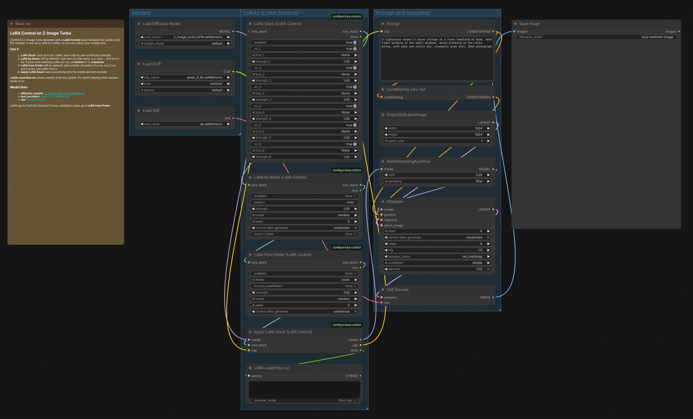

# LoRA Control for ComfyUI

Four nodes for building LoRA stacks: pick LoRAs by hand, by part of their
name, or from a folder, at random or in sequence, then apply the lot in one go.

| Node | Adds to the stack |
| --- | --- |
| **LoRA Stack** | Up to six LoRAs, each with its own on/off and strength |
| **LoRA by Name** | One LoRA whose name contains a pattern, such as `char-` |
| **LoRA from Folder** | One LoRA from a folder, with or without its subfolders |
| **Apply LoRA Stack** | Loads everything in the stack onto MODEL and CLIP |

They pass along a standard `LORA_STACK`, the same type the Comfyroll and
Efficiency stack nodes use, so they chain with each other in any order and
with those packs. Every node also outputs a text line naming what it picked,
so a random choice is never a mystery. Wire it to a Preview Any or into a
filename prefix.

All four are under **loaders › LoRA Control** in the node menu.



## Who this is for

Anyone with more than a handful of LoRAs who wants to try them without
rewiring: cycle through a folder of styles one per run, let a random
character LoRA pick itself, or keep a fixed set of helper LoRAs on while
another changes. The nodes only choose and apply LoRAs; they never modify,
move or download files.

## Install

It isn't on the Comfy Registry (and so ComfyUI-Manager) yet. Clone it into
`ComfyUI/custom_nodes` and restart ComfyUI:

```bash
cd ComfyUI/custom_nodes
git clone https://github.com/nzkritik/comfyui-lora-control
```

No extra Python packages are needed. It uses ComfyUI's V3 node API, so it
needs ComfyUI 0.3.48 or newer (tested on 0.37).

## Example workflow

**Workflow › Browse Templates › comfyui-lora-control › LoRA Control - Z-Image
Turbo** is ComfyUI's own Z-Image Turbo template with a LoRA Control stack
between the loaders and the sampler. It uses the template's model files
(`z_image_turbo_bf16`, `qwen_3_4b`, `ae`), with download links in its note,
and it runs as is with no LoRAs, so you can check your models first. Then
pick LoRAs in the stack, or turn on LoRA by Name or LoRA from Folder.

## Random or in sequence

LoRA by Name and LoRA from Folder both have a `mode` and a `seed`:

- **random** (the default) picks one of the matching LoRAs using the seed. The
  same seed always picks the same LoRA, so reopening an old image's workflow
  gives the same result. The seed's control is set to *randomize*, so every
  run picks afresh.
- **sequence** takes the matching LoRAs in name order, one per run, and wraps
  around at the end. The seed is the position in that list, and switching to
  sequence sets its control to *increment*, so each run moves on by one. Set
  the seed to 0 to start from the top.

The seed control only changes when you change the mode, so a workflow you
saved with some other setting keeps it.

In random mode a picker skips LoRAs already earlier in the stack, so two
LoRA by Name nodes on `char-` never land on the same one. Sequence mode
doesn't skip, because that would shift the order you're stepping through.

## LoRA by Name

`pattern` is any part of the file name, in any case: `char-` matches
`char-Alice.safetensors` and `CHAR-Bella.safetensors`. Only the file name
counts, not the folder it is in, unless you turn on `match_folder`, which lets
`characters/` select a whole folder.

Wildcards (`*`, `?`, `[...]`) switch to matching the whole name instead:
`char-A*` is every `char-` LoRA that starts with A, and `*-ink` is any name
ending in `-ink`.

## LoRA from Folder

`folder` lists every folder under `models/loras` that holds LoRAs, plus
`(root)` for the top level. With `include_subfolders` on, LoRAs in folders
below it count too.

## If nothing matches

A pattern or folder with no LoRAs in it stops the run with an error naming
it, rather than quietly rendering without the LoRA.

## Stack order

Apply loads LoRAs in stack order, first to last. The order changes the image
very slightly (the patches are summed in bf16), so the same LoRAs and seed in
a different order are close but not pixel-identical. Keep the order fixed
when you need to reproduce an image exactly.

## Tests

```bash
uv run --no-project --with pytest python -m pytest tests   # selection logic, no ComfyUI needed
```

The other checks drive a real ComfyUI. `tests/make_test_base.py` builds a
throwaway base directory with dummy LoRAs and this pack linked in; start a
second ComfyUI on it, as its docstring shows, then:

```bash
python3 tests/api_check.py http://127.0.0.1:8189   # the nodes, through the HTTP API
node tests/ui_check.mjs http://127.0.0.1:8189      # the seed-control script, in headless Chromium
```

`tests/zimage_check.py --lora <a Z-Image LoRA>` renders one seed three ways
(no LoRA; the LoRA through these nodes; the same LoRA through
ZImageTurboLoraStackV4) on a ComfyUI with Z-Image Turbo, and reads the log for
skipped LoRA keys. On ComfyUI 0.37, ComfyUI's own loader applies Z-Image
LoRAs completely: no skipped keys, and a render pixel-identical to the V4
node's.

## Licence

MIT
